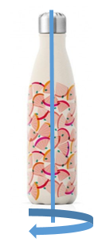

# TD-3 : Application au contrôle qualité d’une gourde décorée

Vous devez concevoir un système de vision pour inspecter des bouteilles décorées en rotation à l’aide d’une caméra linéaire. Voici les spécifications du problème :

<table>
<tr>
<td>
<b>Spécifications :</b>
<ul>
  <li>Cadence de production : 5 bouteilles en 3 secondes</li>
  <li>Dimensions : hauteur 25 cm, diamètre 45 mm</li>
  <li>Précision : détection de 0,15 mm</li>
</ul>
</td>
<td>

</td>
</tr>
</table>

Utilisez un *notebook* Jupyter ou code Python pour répondre aux questions suivantes :

---

## Questions

1. **Périmètre maximal**  
   Calculez le périmètre maximal de la bouteille.

2. **Vitesse maximale d’un élément décoratif**  
   Déterminez la vitesse maximale de déplacement d’un élément du motif sur la surface de la bouteille.

3. **Résolution minimale du capteur CCD linéaire**  
   Calculez le nombre minimal de pixels \( N \) nécessaires pour équiper le capteur CCD linéaire, en prenant un coefficient de sécurité de 2.

4. **Nombre de lignes nécessaires pour le scan**  
   Calculez le nombre total de lignes que la caméra doit capturer pour scanner une bouteille, en appliquant le même coefficient de sécurité.

5. **Fréquence de la caméra**  
   Déterminez la fréquence d’acquisition (en images par seconde) requise pour suivre la cadence de production.

6. **Temps d’exposition maximal**  
   Sachant que le temps de transfert d’une ligne est de 15 × 10-5 secondes, calculez le temps d’exposition maximal restant pour la caméra.

7. **Choix d’une caméra adaptée**  
   Trouvez une caméra répondant aux besoins définis (distributeurs recommandés : Basler, Thorlabs, IDS Imaging, Keyence, etc.).

8. **Grandissement de l’image**  
   Calculez le grandissement de l’image pour la caméra identifiée.

9. **Distance de travail et choix de focale**  
   Calculez la distance de travail pour des focales de 6 mm, 8 mm et 12 mm. La distance maximale de travail disponible est de 1 mètre. Déterminez la meilleure focale.

10. **Ajustement du temps d’exposition**  
    Lors d’un premier test avec un temps d’exposition initial 1.5 × 10-4 secondes, la valeur maximale de l’image est de 45. En supposant que la réponse de la caméra est linéaire et que son capteur est de 8 bits, de combien devez-vous augmenter le temps d’exposition pour exploiter toute la dynamique du capteur ?

11. **Exploitation de la dynamique du capteur**  
    Est-il possible d’exploiter pleinement la dynamique du capteur tout en respectant la cadence de production ? Si ce n’est pas possible, proposez une solution alternative.

